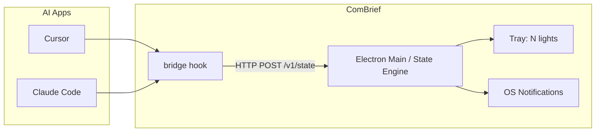

# ComBrief 设计规格

**日期**：2026-05-27  
**状态**：待审阅  
**摘要**：跨平台（macOS + Windows）菜单栏/托盘应用，为每个已配置的 AI App 显示独立状态灯，通过最小侵入式 hook bridge 上报状态。

---

## 1. 目标与背景

ComBrief 是一个 Node.js（Electron）桌面应用，常驻系统托盘/菜单栏，用「信号灯」展示各 AI 编程助手的工作状态，避免频繁切换窗口查看 Agent 是否在干活、是否在等待用户。

### 1.1 成功标准（MVP）

- 支持 **Cursor** 与 **Claude Code**，每个 App **独立一盏灯**
- 四态语义正确率可接受（允许通过超时与设置微调）
- 添加 App 时 **全自动** 安装 hook，**最小侵入** 用户配置，卸载可还原
- 红灯时 **系统通知** + 托盘 **快速闪烁**
- 黄灯 **呼吸**，绿灯 **常亮**，灰灯 **暗淡常亮**
- 运行于 **macOS** 与 **Windows**

### 1.2 非目标（MVP）

- Trae Solo、Linux
- 项目级 hooks（仅用户级）
- 云同步、多机状态
- 读取或存储 prompt 全文

---

## 2. 需求摘要（Brainstorming 结论）

| 决策项 | 选择 |
|--------|------|
| 平台 | macOS + Windows |
| 多 App 展示 | 每个 App 一盏灯（并排） |
| 红灯通知 | 需要系统通知 |
| 动画 | 绿常亮、黄呼吸、红快闪、灰暗淡常亮 |
| Hook 安装 | 全自动；逻辑外挂于 `~/.combrief/`，用户 `hooks.json` 仅增加一条 bridge |
| MVP App | Cursor + Claude Code |

### 2.1 状态语义

| 状态 | 颜色 | 含义 |
|------|------|------|
| `idle` | 绿 | AI 在线，无进行中任务，且非等待用户 |
| `working` | 黄 | AI 正在执行任务（推理、工具调用等） |
| `waiting_user` | 红 | AI 等待用户输入或确认 |
| `offline` | 灰 | App 未连接或无心跳 |

**语义说明**：采用「注意力导向」而非传统交通灯（绿≠正在运行）。红灯表示需要你介入；绿灯表示无需关注。

---

## 3. 方案选型

### 3.1 候选方案

1. **Electron 单体**（选用）：托盘 + 内嵌本地 HTTP 服务 + TypeScript 安装器  
2. **Tauri 2**：更轻，但多图标动画与 hook 安装器开发成本高  
3. **Node 守护进程 + 薄托盘客户端**：过度设计，留作日后拆分

### 3.2 选用理由

Electron 在双平台上对多托盘图标、动画、系统通知、Node 生态 hook 脚本支持最好，最适合 MVP 交付速度。

---

## 4. 架构



### 4.1 进程与目录

**运行时目录**（用户级）：

```
~/.combrief/
  config.json          # 端口、token、超时、已注册 app 列表
  apps/
    cursor/
      bridge.mjs
      manifest.json    # hooks 路径、版本
    claude-code/
      bridge.mjs
      manifest.json
  backups/
    cursor/<timestamp>.json
    claude-code/<timestamp>.json
  logs/
```

**仓库目录**（开发）：

```
combrief/
  src/main/            # tray, state, server, installer
  src/renderer/        # 设置窗口（可选）
  extensions/          # 各 app 适配模板源
    cursor/
    claude-code/
  docs/specs/
```

### 4.2 Hook 外挂策略

1. 所有业务脚本与状态逻辑仅位于 `~/.combrief/apps/<appId>/`  
2. 安装时在用户 `hooks.json` **仅追加一条** 命令，指向 `bridge`  
3. `bridge` 流程：读 stdin → POST 状态到 ComBrief → **链式执行**用户原有 hook（安装前备份）→ 透传 stdout  
4. 卸载：移除 bridge 条目，从 `backups/` 还原；删除或保留 `~/.combrief/apps/<appId>/`（用户可选）  
5. 若未来工具支持独立 hooks 源，可改为零行写入，bridge 条目可删除

**原则**：fail-open——ComBrief 未运行或 POST 失败时，不阻断 AI 工具正常工作。

---

## 5. 状态机

### 5.1 事件 → 状态映射

| Hook 事件（示例） | 映射状态 |
|-------------------|----------|
| `sessionStart` | `working` 或 `idle`（依上下文） |
| `beforeSubmitPrompt` | `working` |
| `preToolUse` / `postToolUse` | `working` |
| `stop` / `afterAgentResponse` | `waiting_user` |
| `sessionEnd` | `offline` |
| 无事件 ≥ T 秒 | `offline` |

### 5.2 边界规则

- **红**：`stop` / `afterAgentResponse` 后判定 Agent 一轮结束，等待用户下一条输入或确认  
- **黄**：用户提交 prompt 后至本轮 `stop` 之前  
- **绿**：在线、无进行中任务、非等待用户；`beforeSubmitPrompt` 之后若 N 秒无工具活动可回绿（N 可配置，默认 5）  
- **灰**：超过心跳超时 T（默认 45s）无 hook 上报  

### 5.3 通知

- 仅在进入 `waiting_user` 时发送系统通知  
- 标题：`{App 名} 需要你`  
- 防抖：同一 App 红灯重复通知间隔 ≥ 30s，除非中间离开红灯再回到红灯  

---

## 6. 本地 API

**基址**：`http://127.0.0.1:<port>`（默认端口 `3847`，写入 `config.json`）

### 6.1 `POST /v1/state`

请求体：

```json
{
  "appId": "cursor",
  "event": "stop",
  "sessionId": "optional-uuid",
  "timestamp": 1730000000000,
  "meta": { "project": "optional-low-sensitivity" }
}
```

响应：`200 { "ok": true }`；未知 `appId`：`400`

### 6.2 `GET /v1/health`

响应：`200 { "ok": true, "version": "0.1.0" }`

### 6.3 认证（可选）

`config.json` 中的 `token`；bridge 发送 `Authorization: Bearer <token>`。MVP 安装时自动生成随机 token。

---

## 7. UI 与交互

### 7.1 托盘

- 每个已添加 App 一个 `Tray` 图标（8–12px 圆点 + 可选缩写）  
- 动画：绿常亮、黄呼吸（周期 1.5–2s）、红快闪（2–3 Hz）、灰低亮常亮  

### 7.2 右键菜单（单 App）

- 当前状态文案  
- 上次更新时间  
- 打开 `~/.combrief/apps/<appId>/`  
- 重新安装 Hooks  
- 移除此 App  

### 7.3 全局设置

- 添加 App（Cursor / Claude Code）  
- 通知总开关（默认开）  
- 开机自启  
- 心跳超时 T、空闲回绿时间 N  
- 关于 / 退出  

### 7.4 添加向导

1. 选择 App 类型  
2. 检测应用/CLI 是否存在（不存在则警告，仍可预装 hook）  
3. 备份 `hooks.json` → 注入 bridge → 释放脚本  
4. 新灯出现（灰），首次心跳后更新  

### 7.5 平台差异

| 项 | macOS | Windows |
|----|-------|---------|
| 托盘 | 菜单栏多 `Tray` | 通知区多图标或单图多灯 |
| 开机启动 | `app.setLoginItemSettings` | Startup 快捷方式 / 注册表 |
| Bridge 启动 | `#!/usr/bin/env node` + `bridge.mjs` | `bridge.cmd` 调用 `node bridge.mjs` |
| 通知 | `Notification` | Toast（注意专注助手） |

macOS 菜单栏空间有限；MVP 仅 2 个 App 足够。后续版本可在 App 数 > 4 时提供收纳模式。

---

## 8. 安全

- HTTP 服务 **仅绑定** `127.0.0.1`  
- 可选 Bearer token  
- Hook **不记录** prompt 全文；`meta` 仅低敏字段  
- 安装/卸载 **不请求** 管理员权限  

---

## 9. 错误处理

| 场景 | 行为 |
|------|------|
| ComBrief 未运行 | bridge 仍链式执行原 hook；灯保持灰或上次状态 |
| POST 失败 | 写 `~/.combrief/logs/`；不阻断 AI |
| 已安装 ComBrief bridge | 跳过或按版本升级 |
| 备份失败 | 中止安装，不改用户文件 |
| 还原失败 | UI 显示备份路径与手动恢复说明 |
| 通知权限被拒 | 红灯闪烁仍有效；设置中提示开启权限 |

---

## 10. 测试计划

### 10.1 单元测试

- 状态机 event 序列 → 四态  
- 通知防抖逻辑  

### 10.2 集成测试

- Mock `POST /v1/state` → 托盘状态更新  
- bridge：stdin 样例 → POST + 链式 mock hook  

### 10.3 手动 E2E

1. Cursor：prompt → 黄 → 结束 → 红+通知 → 回复 → 黄 → 空闲 → 绿  
2. 退出 Cursor → 灰  
3. 同时添加 Claude Code，双灯独立  
4. 卸载：hooks 还原、灯移除  
5. Windows 重复以上流程  

---

## 11. 技术栈

| 层 | 选型 |
|----|------|
| 桌面壳 | Electron 33+ |
| 语言 | TypeScript |
| 打包 | electron-builder（dmg + nsis） |
| 配置 | `~/.combrief/config.json` |

---

## 12. 后续扩展（非 MVP）

- Trae Solo（hooks 或降级探测，UI 标注支持级别）  
- 守护进程与托盘分离  
- 项目级 hooks 可选  
- 闪烁红表示错误/超时  
- 收纳模式（菜单栏 App 过多）  
- 纯外挂 hooks 源（零行写入用户 `hooks.json`）

---

## 13. 修订记录

| 日期 | 说明 |
|------|------|
| 2026-05-27 | 初稿，Brainstorming 定稿 |
